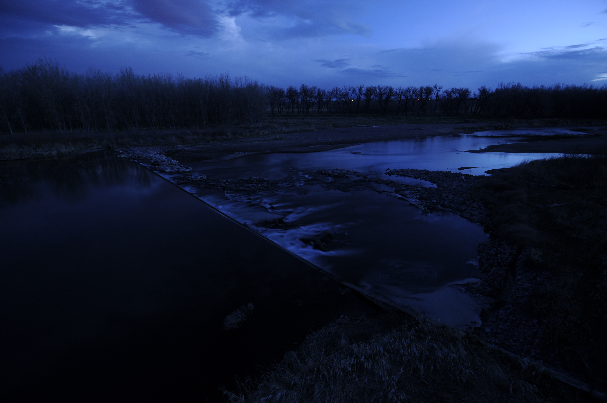

# River 

## River Stage level prediction using images

### Problem
The objective of this project is to create an AI model to predict the level of Stage seeking to implement the same strategy for other values such as Discharge.

Currently these values are obtained from sensors in the river, we have values since 2012, the problem with the sensors is the cost of keeping them working correctly and the cost of buying them whenever necessary.

### Images
Variety of images provided

>
>
>
>
>